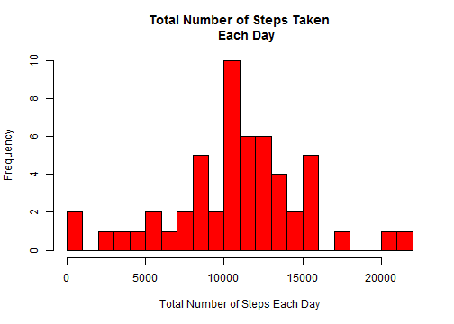
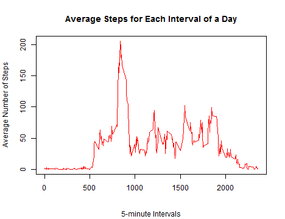
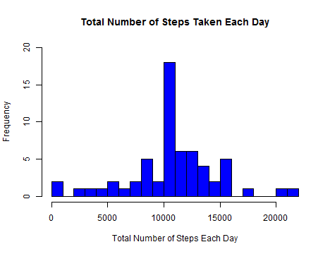
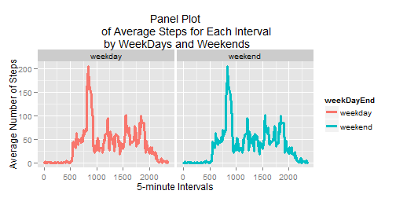

## Synopsis

This assignment presents the analysis of data about personal movements using activity monitoring devices such as a Fitbit, Nike Fuelband, or Jawbone Up. These type of devices are part of the "quantified self" movement - a group of enthusiasts who take measurements about themselves regularly to improve their health, to find patterns in their behavior, or because they are tech geeks. We are given a large amount of data from a personal activity monitoring device.

The data represents the number of steps taken by an anonymous individual reported every 5-minute interval over 24 hours in a day. The total data was collected over two months or 61 days. This report analyzes the data using R and answers several multipart questions as part of this assignment.

## Questions

#### Loading the data

* Load the data into a data frame from the provided csv file and explore the structure and various column heading. "csv" file was already unzipped and available in the source directory.


```r
activityData <- read.csv("activity.csv", header = TRUE)
head(activityData)
```

```
##   steps       date interval
## 1    NA 2012-10-01        0
## 2    NA 2012-10-01        5
## 3    NA 2012-10-01       10
## 4    NA 2012-10-01       15
## 5    NA 2012-10-01       20
## 6    NA 2012-10-01       25
```

```r
str(activityData)
```

```
## 'data.frame':	17568 obs. of  3 variables:
##  $ steps   : int  NA NA NA NA NA NA NA NA NA NA ...
##  $ date    : Factor w/ 61 levels "2012-10-01","2012-10-02",..: 1 1 1 1 1 1 1 1 1 1 ...
##  $ interval: int  0 5 10 15 20 25 30 35 40 45 ...
```

#### Transformation and processing of data

* Several NA (missing) values were observed in the data. For the first part of the analysis we ignore the missing values.

* Only transformation of data was done to convert 5-minute time intervals into their corresponding hour/minute times and store in a separate column alongwith corresponding date. This can be used for showing the steps data in a graph on a hour/minute scale instead of 5-minute intervals.


```r
hours <- activityData$interval %/% 100
minutes <- activityData$interval %% 60
times <- sprintf("%02d:%02d", hours, minutes)
dateTimes <- paste(activityData$date, times)
activityData <- cbind(activityData, dateTimes)
```

#### Mean total number of steps taken per day

* Calculate the mean total number of steps taken per day. (Ignore the missing values). 


```r
totalStepsPerDay <- aggregate(steps ~ date, data=activityData, FUN=sum)
mean(totalStepsPerDay$steps)
```

```
## [1] 10766
```

* Mean total number of steps taken per day are 10766.

#### Histogram of total number of steps per day

* Plot a histogram of the total number of steps taken each day where total steps across all the time intervals in a day were calculated for all the days in the data. 


```r
hist(totalStepsPerDay$steps, breaks = 20, col = "red", main = "Total Number of Steps Taken
     Each Day", xlab = "Total Number of Steps Each Day")
```

 

### Calculate and report the mean and median total number of steps taken per day 

* Mean is 10766
* Median is 10765.


```r
mean(totalStepsPerDay$steps)
```

```
## [1] 10766
```

```r
median(totalStepsPerDay$steps)
```

```
## [1] 10765
```

#### Time series plot of the average daily activity pattern

* In order to look at the average daily activity pattern, We plot the average number of steps for each interval for a day as a time series plot (i.e. type = "l") of the 5-minute interval (x-axis) and the average number of steps taken, averaged across all days (y-axis).

* Pattern on the plot shows the highest amount of activity during the mid morning hours.


```r
meanStepsPerInterval <- aggregate(steps ~ interval, data=activityData, FUN=mean)
plot(steps ~ interval, type = "l", col = "red", ann = F, data=meanStepsPerInterval)
title(main="Average Steps for Each Interval of a Day",
      sub = "5-minute Intervals", ylab = "Average Number of Steps")
```

 

#### 5-minute interval with maximum activity

* Which 5-minute interval, on average across all the days in the dataset, contains the maximum number of steps?


```r
maxStepsInterval <- with(meanStepsPerInterval, interval[steps== max(steps)])
maxSteps <- max(meanStepsPerInterval$steps)

maxStepsInterval
```

```
## [1] 835
```

```r
round(maxSteps, 0)
```

```
## [1] 206
```

* Maximum number of steps are 206 during the interval 835 (which represents time around 8:35 in the morning).

#### Imputing missing values

* There are a number of days/intervals where there are missing values (coded as NA). The presence of missing days may introduce bias into some calculations or summaries of the data.

* Calculate and report the total number of missing values in the dataset (i.e. the total number of rows with NAs) which comes out to be 2304. We also confirm that these missing values are only in the steps column.


```r
sum(is.na(activityData))
```

```
## [1] 2304
```

```r
sum(is.na(activityData$steps))
```

```
## [1] 2304
```

#### Strategy for imputing missing values

* A strategy has been devised for filling in all of the missing values in the dataset by calculating the means of all the daily 5-minute intervals across all days and then  filling in the mean values in the respective intervals where values are missing.

* A new dataset, "activityDataNew"", is created that is equal to the original dataset but with the missing data values filled in.


```r
activityDataNew <- merge(activityData, meanStepsPerInterval, by = "interval")
colnames(activityDataNew)[2] <- "steps"
colnames(activityDataNew)[5] <- "averageSteps"

# Remove missing values (NA) and replace them with the average steps for the
# corresponding interval

activityDataNew$steps[is.na(activityDataNew$steps)] <-
    activityDataNew$averageSteps[is.na(activityDataNew$steps)]
```

#### Histogram of total number of steps taken each day

* Make a histogram of the total number of steps taken each day and Calculate and report the mean and median total number of steps taken per day.

* The histogram differ from the Do these values differ from the estimates from the first part of the assignment? What is the impact of imputing missing data on the estimates of the total daily number of steps?


```r
totalStepsByDay <- aggregate(steps ~ date, data = activityDataNew, FUN=sum)
hist(totalStepsByDay$steps, breaks = 20, col = "blue", main = "Total Number of Steps Taken
     Each Day", xlab = "Total Number of Steps Each Day")
```

 

```r
mean(totalStepsByDay$steps)
```

```
## [1] 10766
```

```r
median(totalStepsByDay$steps)
```

```
## [1] 10766
```

* Mean and Median values are still pretty much the same even after imputing the missing value - Mean = 10766 and Median = 10766.

#### Difference between weekdays and weekends activity patterns

* Are there differences in activity patterns between weekdays and weekends?

* A new column is added to the data frame "activityDataNew" based on the date value. Based on the date, we determine the day of the week and add this to a column named "dayName".
* Based on the name of the day in "dayName" column, we determine whether it is a weekday or weekend day and then add "weekend" or "weekday" to the column named "weekDayEnd".


```r
activityDataNew[ , "weekDayEnd"] <- as.factor(ifelse(!weekdays(as.Date(activityDataNew$date,
        '%Y-%m-%d')) %in% c("Saturday", "Sunday"), "weekday","weekend"))
# write.table(activityDataNew, "activityDataNew.csv", sep=",", row.name=FALSE)
averageStepsByWeekEndDay <- aggregate(averageSteps ~ weekDayEnd * interval, data = activityDataNew,
        FUN=mean)
# write.table(averageStepsByWeekEndDay, "averageStepsByWeekEndDay.csv", sep=",", row.name=FALSE)
```

#### Panel plot of time-series

* Make a panel plot containing a time series plot (i.e. type = "l") of the 5-minute interval (x-axis) and the average number of steps taken, averaged across all weekday days or weekend days (y-axis). We use the ggplot2 to create the multi-panel plot.


```r
library(ggplot2)
qplot(interval, averageSteps, data=averageStepsByWeekEndDay, geom = c("line"),
        size = I(1.1), facets = .~weekDayEnd, col=weekDayEnd, xlab = 
        "5-minute Intervals", ylab = "Average Number of Steps", main = "Panel Plot
        of Average Steps for Each Interval \n by WeekDays and Weekends")
```

 
