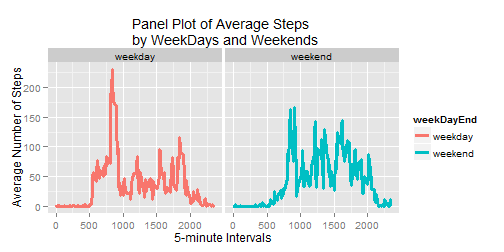

## Synopsis

This assignment presents the analysis of data about personal movements using activity monitoring devices such as a Fitbit, Nike Fuelband, or Jawbone Up. These type of devices are part of the "quantified self" movement - a group of enthusiasts who take measurements about themselves regularly to improve their health, to find patterns in their behavior, or because they are tech geeks. We are given a large amount of data from a personal activity monitoring device.

The data represents the number of steps taken by an anonymous individual reported every 5-minute interval over 24 hours in a day. The total data was collected over two months or 61 days. This report analyzes the data using R and answers several multipart questions as part of this assignment.

## Questions

#### Loading the data

* Data was loaded into a data frame by extracting the csv file from the provided zip file. We explored the structure and various column headings of the data. "zip" file was already available in the source directory.


```r
activityData <- read.table(unz("repdata-data-activity.zip", "activity.csv"),
    sep = ",", header = TRUE)
head(activityData)
```

```
##   steps       date interval
## 1    NA 2012-10-01        0
## 2    NA 2012-10-01        5
## 3    NA 2012-10-01       10
## 4    NA 2012-10-01       15
## 5    NA 2012-10-01       20
## 6    NA 2012-10-01       25
```

```r
str(activityData)
```

```
## 'data.frame':	17568 obs. of  3 variables:
##  $ steps   : int  NA NA NA NA NA NA NA NA NA NA ...
##  $ date    : Factor w/ 61 levels "2012-10-01","2012-10-02",..: 1 1 1 1 1 1 1 1 1 1 ...
##  $ interval: int  0 5 10 15 20 25 30 35 40 45 ...
```

#### Transformation and processing of data

* Several NA (missing) values were observed in the data. For the first part of the analysis we ignore the missing values.

* Only transformation of data was done to convert 5-minute time intervals into their corresponding hour/minute times and store in a separate column alongwith corresponding date. This can be used for showing the steps data in a graph on a hour/minute scale instead of 5-minute intervals.


```r
hours <- activityData$interval %/% 100
minutes <- activityData$interval %% 60
times <- sprintf("%02d:%02d", hours, minutes)
dateTimes <- paste(activityData$date, times)
activityData <- cbind(activityData, dateTimes)
```

#### Mean total number of steps taken per day

* The mean of total number of steps taken per day was calculated while ignoring the  missing values. 


```r
totalStepsPerDay <- aggregate(steps ~ date, data=activityData, FUN=sum)
mean(totalStepsPerDay$steps)
```

```
## [1] 10766
```

* Mean total number of steps taken per day are 10766.

#### Histogram of total number of steps per day

* Plotted a histogram of the total number of steps taken each day where total steps across all the time intervals in a day were calculated for all the days in the data. Data looks approximately normal with no noticeable skewness. 


```r
hist(totalStepsPerDay$steps, breaks = 20, col = "red", main = "Total Number of Steps Taken
    Each Day", xlab = "Total Number of Steps Each Day")
```

 

### Report mean and median total number of steps taken per day 

* Mean is 10766
* Median is 10765.


```r
mean(totalStepsPerDay$steps)
```

```
## [1] 10766
```

```r
median(totalStepsPerDay$steps)
```

```
## [1] 10765
```

#### Time series plot of the average daily activity pattern

* In order to look at the average daily activity pattern, plotted the average number of steps for each interval for a day as a time series plot (i.e. type = "l") of the 5-minute interval (x-axis) and the average number of steps taken, averaged across all days (y-axis).

* Pattern on the plot shows the highest amount of activity during the mid morning hours.


```r
meanStepsPerInterval <- aggregate(steps ~ interval, data=activityData, FUN=mean)
plot(steps ~ interval, type = "l", col = "red", ann = F, data=meanStepsPerInterval)
title(main="Average Steps for Each Interval of a Day",
    sub = "5-minute Intervals", ylab = "Average Number of Steps")
```

 

#### 5-minute interval with maximum activity

* Which 5-minute interval, on average across all the days in the dataset, contains the maximum number of steps?


```r
maxStepsInterval <- with(meanStepsPerInterval, interval[steps== max(steps)])
maxSteps <- max(meanStepsPerInterval$steps)

maxStepsInterval
```

```
## [1] 835
```

```r
round(maxSteps, 0)
```

```
## [1] 206
```

* Maximum number of steps are 206 during the interval 835 (which represents time around 8:35 in the morning).

#### Imputing missing values

* There are a number of days/intervals where there are missing values (coded as NA). The presence of missing days may introduce bias into some calculations or summaries of the data.

* The total number of missing values(i.e. the total number of rows with NA) in the dataset were calculated and reported which comes out to be 2304. We also confirm that these missing values are only in the steps column.


```r
sum(is.na(activityData))
```

```
## [1] 2304
```

```r
sum(is.na(activityData$steps))
```

```
## [1] 2304
```

#### Strategy for imputing missing values

* A strategy was devised for filling in all of the missing values in the dataset by calculating the means of all the daily 5-minute intervals across all days and then  filling in the mean values in the respective intervals where values are missing.

* A new dataset, "activityDataNew", is created that is equal to the original dataset but with the missing data values filled in.


```r
activityDataNew <- merge(activityData, meanStepsPerInterval, by = "interval")
colnames(activityDataNew)[2] <- "steps"
colnames(activityDataNew)[5] <- "averageSteps"

# Remove missing values (NA) and replace them with the average steps for the
# corresponding interval

activityDataNew$steps[is.na(activityDataNew$steps)] <-
    activityDataNew$averageSteps[is.na(activityDataNew$steps)]
```

#### Histogram of total number of steps taken each day

* Plotted a histogram of the total number of steps taken each day after the imputing the missing values.

* This histogram differs from the previous histogram in the respect that it displays more data points with average number of steps taken each day. Again, this is expected because we replaced missing values with the average values. We replaced a total of 8 days with average values.


```r
totalStepsByDay <- aggregate(steps ~ date, data = activityDataNew, FUN=sum)
hist(totalStepsByDay$steps, breaks = 20, col = "blue", ylim = c(0, 20),
     main = "Total Number of Steps Taken Each Day",
     xlab = "Total Number of Steps Each Day")
```

 

#### Report mean and median of the total number of steps taken each day

* Mean = 10766
* Median = 10766

* Mean and Median values have not changed after imputing the missing values. This is as expected since we replaced the missing values by the average values of the respective intervals.


```r
mean(totalStepsByDay$steps)
```

```
## [1] 10766
```

```r
median(totalStepsByDay$steps)
```

```
## [1] 10766
```

#### Difference between weekdays and weekends activity patterns

* Are there differences in activity patterns between weekdays and weekends?

* A new column was added to the data frame "activityDataNew" based on the date value. Based on the date, we determined the day of the week and further determined whether that day is a "weekday" or a "weekend". These two values were added to a new column called, "weekDayEnd".


```r
activityDataNew[ , "weekDayEnd"] <- as.factor(ifelse(!weekdays(as.Date(activityDataNew$date,
    '%Y-%m-%d')) %in% c("Saturday", "Sunday"), "weekday","weekend"))
averageStepsByWeekEndDay <- aggregate(steps ~ weekDayEnd * interval, data =
    activityDataNew, FUN=mean)
```

#### Panel plot of time-series

* Plotted a panel plot containing a time series plot (i.e. type = "l") of the 5-minute interval (x-axis) and the average number of steps taken, averaged across all weekday days or weekend days (y-axis). Used ggplot2 to create the multi-panel plot.

* The plots show a remarkable difference between weekdays' and weekends' activity levels both in timing and frequency.


```r
library(ggplot2)
qplot(interval, steps, data=averageStepsByWeekEndDay, geom = c("line"),
    size = I(1.1), facets = .~weekDayEnd, col=weekDayEnd, xlab = 
    "5-minute Intervals", ylab = "Average Number of Steps", main =
    "Panel Plot of Average Steps \n by WeekDays and Weekends")
```

 
